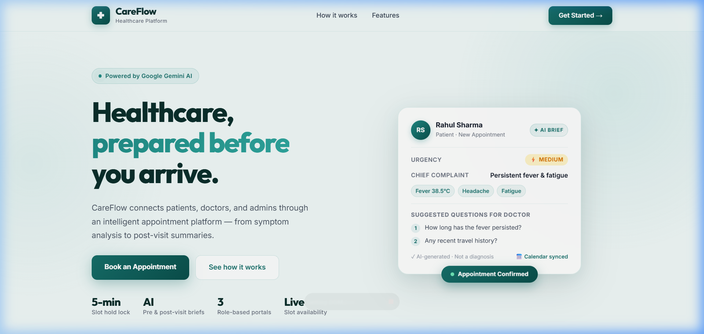
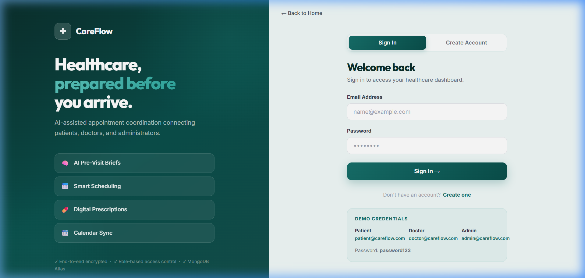
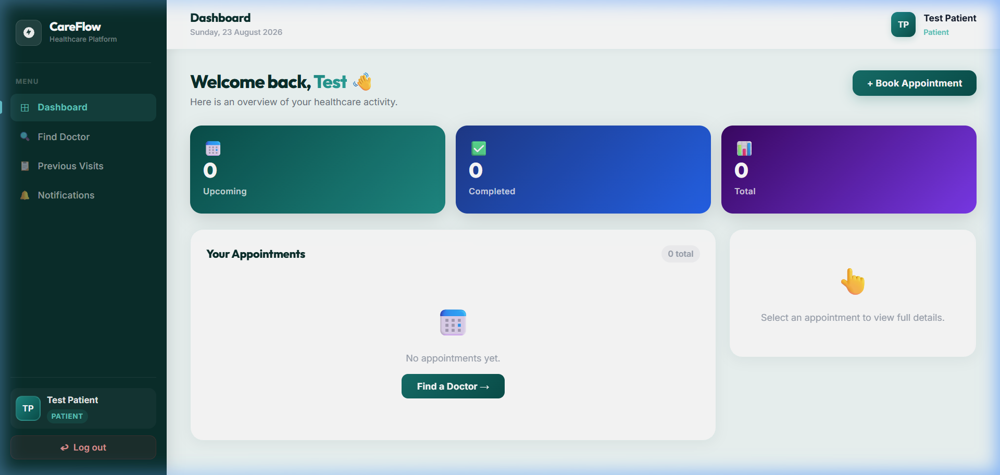
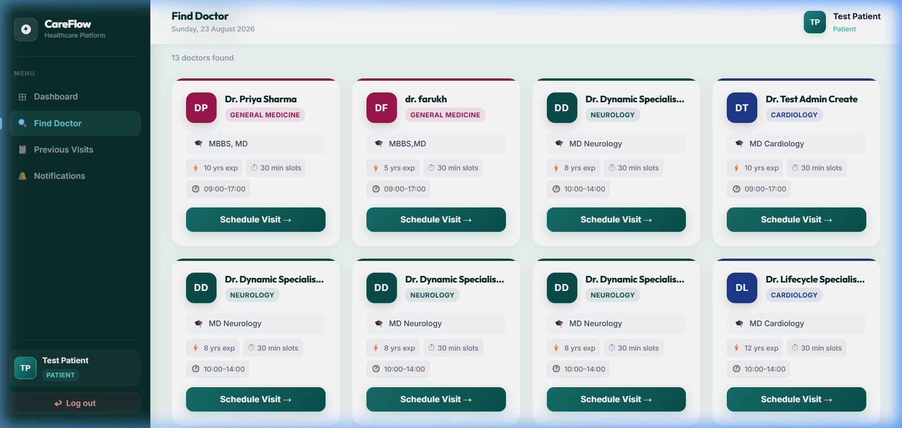
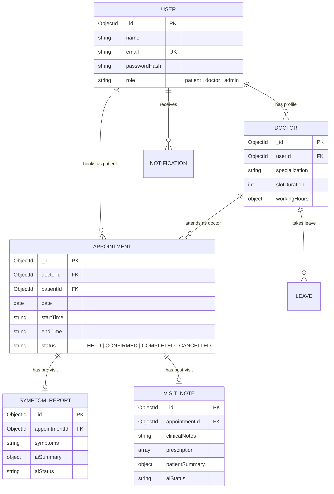

# 🏥 CareFlow — AI-Assisted Healthcare Appointment & Follow-up Platform

> **Healthcare, prepared before you arrive.**

[](https://www.mongodb.com/atlas)
[](https://nodejs.org)
[](https://react.dev)
[](https://ai.google.dev)
[](https://developers.google.com/calendar)

---

## 🌟 Key Features & MVP Capabilities

CareFlow is a full-stack healthcare coordination platform built with the MERN stack, Google GenAI SDK, Nodemailer, and Google Calendar API.

### 🔥 Attention-Grabbing Core Features
- 🧠 **AI Pre-Visit Briefs (Google Gemini AI)**: Patients share symptoms before booking. Gemini AI analyzes the input to generate a structured pre-visit brief for doctors — complete with urgency classification (`Low`, `Medium`, `High`), chief complaints, and 3 suggested clinical questions.
- 💊 **AI Post-Visit Patient Summaries**: Doctors submit clinical notes and structured prescriptions. Gemini AI translates technical notes into a clear, patient-friendly summary with safety precaution guidelines.
- 🔒 **Double-Booking Protection**: Atomic 5-minute slot hold locks (`SlotHold` collection) and MongoDB Partial Unique Indexes on `{ doctorId, date, startTime }` prevent race conditions and concurrent double-booking attempts.
- 🏖️ **Doctor Leave & Conflict Management**: Admin/doctor leave registration automatically cancels conflicting appointments on that date, updates Google Calendar events, and sends notifications to affected patients.
- ⏰ **Real-Time Time-Aware Availability**: Slots are filtered dynamically in real time relative to `Asia/Kolkata` local clock time. Passed time slots for today are automatically marked unbookable.
- 📆 **Google Calendar Integration (OAuth 2.0)**: Confirmed appointments automatically create Google Calendar events for both patient and doctor; cancellations or leave conflicts automatically sync calendar updates.
- 🔔 **Resilient Notification Worker**: Database-backed notification queue with background Nodemailer SMTP integration and exponential backoff retry worker.

---

## 📸 Visual Showcase (Overhauled UI)

| 🏠 1. Landing Page (Modern Glassmorphism) | 🔑 2. Split-Panel Authentication |
|---|---|
|  |  |

| 📊 3. Patient Dashboard (Gradient Stat Cards) | 🩺 4. Find Specialist & Doctor Search |
|---|---|
|  |  |

---

## 🔐 Dummy Test Credentials for Evaluation

Try out all features across all three role portals using these pre-seeded accounts:

| Role | Email | Password | Available Features & Permissions |
|---|---|---|---|
| 🧑‍🦱 **Patient** | `patient@careflow.com` | `password123` | Search doctors, 5-min slot hold, submit symptoms, view AI post-visit summaries, notification history |
| 👨‍⚕️ **Doctor** | `doctor@careflow.com` | `password123` | View appointment roster, read AI pre-visit briefs, submit clinical notes & prescriptions |
| 🛡️ **Admin** | `admin@careflow.com` | `password123` | Register doctor profiles, set working hours/slot duration, manage doctor leaves, activate/deactivate users, view analytics |

---

## 🚀 Local Setup & Installation Guide

### Prerequisites
- **Node.js**: `v18.x` or higher
- **npm**: `v9.x` or higher
- **MongoDB Atlas Connection URI** (or local MongoDB database)

---

### 1. Backend Setup

```bash
# Navigate to backend directory
cd Backend

# Install dependencies
npm install

# Create environment configuration file
cp .env.example .env
```

Populate your `Backend/.env` configuration:
```env
PORT=5000
NODE_ENV=development
APP_TIMEZONE=Asia/Kolkata
MONGODB_URI=mongodb+srv://<username>:<password>@cluster0.mongodb.net/careflow?retryWrites=true&w=majority
JWT_SECRET=your_super_secret_jwt_key_here
GEMINI_API_KEY=your_gemini_api_key_here
EMAIL_SERVICE=gmail
EMAIL_USER=your_email@gmail.com
EMAIL_PASS=your_email_app_password
GOOGLE_CLIENT_ID=your_google_client_id
GOOGLE_CLIENT_SECRET=your_google_client_secret
GOOGLE_REDIRECT_URI=http://localhost:5000/api/auth/google/callback
FRONTEND_URL=http://localhost:5173
```

Run backend server in development mode:
```bash
npm run dev
```

---

### 2. Frontend Setup

```bash
# Navigate to frontend directory
cd Frontend

# Install dependencies
npm install

# Start Vite development server
npm run dev
```

Access the application in your browser at `http://localhost:5173/`.

---

## 📡 API Endpoint Documentation

### 🔑 Auth API (`/api/auth`)
| Method | Endpoint | Description | Auth Required |
|---|---|---|---|
| `POST` | `/api/auth/register` | Register a new patient account | Public |
| `POST` | `/api/auth/login` | Authenticate & receive HTTP-only JWT token | Public |
| `POST` | `/api/auth/logout` | Revoke & blacklist JWT token (`jti`) | Private |
| `GET`  | `/api/auth/me` | Fetch active user profile | Private |

### 👨‍⚕️ Doctor & Admin API (`/api/admin`, `/api/doctors`)
| Method | Endpoint | Description | Auth Required |
|---|---|---|---|
| `GET`   | `/api/doctors` | Search doctors by specialization / name | Public |
| `GET`   | `/api/doctors/:id` | Fetch detailed doctor profile & working hours | Public |
| `POST`  | `/api/admin/doctors` | Create a new doctor profile | Admin |
| `PATCH` | `/api/admin/doctors/:id` | Update doctor properties | Admin |
| `POST`  | `/api/admin/doctors/:doctorId/leave` | Apply leave & cancel conflicting appointments | Admin / Doctor |

### 📅 Appointment Scheduling API (`/api/appointments`)
| Method | Endpoint | Description | Auth Required |
|---|---|---|---|
| `GET`   | `/api/appointments/doctors/:doctorId/availability?date=YYYY-MM-DD` | Get real-time time-aware available slots | Patient |
| `POST`  | `/api/appointments/hold` | Place 5-minute atomic slot hold reservation | Patient |
| `POST`  | `/api/appointments/confirm` | Confirm booking, trigger calendar sync & email | Patient |
| `GET`   | `/api/appointments` | Fetch user appointments list | Private |
| `PATCH` | `/api/appointments/:id/cancel` | Cancel appointment & release calendar event | Private |

### 🧠 AI Services API (`/api/ai`)
| Method | Endpoint | Description | Auth Required |
|---|---|---|---|
| `POST` | `/api/ai/pre-visit` | Submit patient symptoms for Gemini AI analysis | Patient |
| `POST` | `/api/ai/post-visit` | Submit doctor notes & prescription for AI summary | Doctor |
| `PUT`  | `/api/ai/post-visit/:id` | Edit consultation notes & regenerate AI summary | Doctor / Admin |

---

## 🗄️ Database Schema Layout



---

## 🤖 LLM Prompts & Schemas

### 1. Pre-Visit Brief Prompt & Schema
```text
Analyse these symptoms and return:
urgency level (Low / Medium / High),
chief complaint,
key symptoms,
and three suggested questions for the doctor.

Do not diagnose the patient. Label output clearly matching the response schema.
Symptom Text: "<symptoms>"
```

### 2. Post-Visit Summary Prompt & Schema
```text
Convert these clinical notes into a patient-friendly summary with medication schedule and follow-up steps:
Clinical Notes: "<notes>"
Prescriptions: <prescription_json>

Do not invent any new medications or modify the names or dosages of the prescribed medications.
```

---

## 📆 Google Calendar Integration Setup (OAuth 2.0)

1. Log in to [Google Cloud Console](https://console.cloud.google.com/).
2. Enable **Google Calendar API**.
3. Configure OAuth Consent Screen & add scope `https://www.googleapis.com/auth/calendar.events`.
4. Create **OAuth 2.0 Web Application Credentials**.
5. Set Redirect URI to `http://localhost:5000/api/auth/google/callback`.
6. Add `GOOGLE_CLIENT_ID` and `GOOGLE_CLIENT_SECRET` to `Backend/.env`.

---

## 📐 System Design Overview

*(For the complete standalone 690-word System Design Analysis, see [SYSTEM_DESIGN.md](./SYSTEM_DESIGN.md))*

- **Double-Booking Prevention**: Enforced via atomic `SlotHold` inserts and MongoDB partial unique indexes on `{ doctorId, date, startTime }`.
- **Leave Management**: Applying doctor leave automatically cancels conflicting active appointments (`PENDING`/`CONFIRMED`) and dispatches notifications.
- **Slot Hold & Time Awareness**: 300-second TTL holds prevent slot hoarding. Real-time time filtering in `Asia/Kolkata` disables past time slots.
- **Notification Reliability**: Database-backed notification queue with background Nodemailer worker, exponential backoff retries, and AI quota failure mitigation.

---

## 📄 License & Author

Built for CareFlow Healthcare Project using React, Node.js, Express, MongoDB Atlas, and Google Gemini AI.
