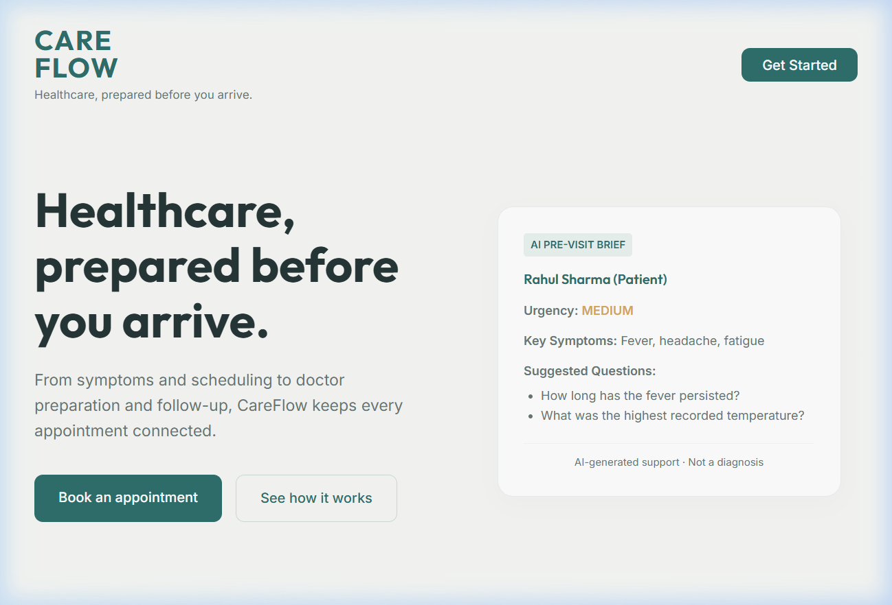
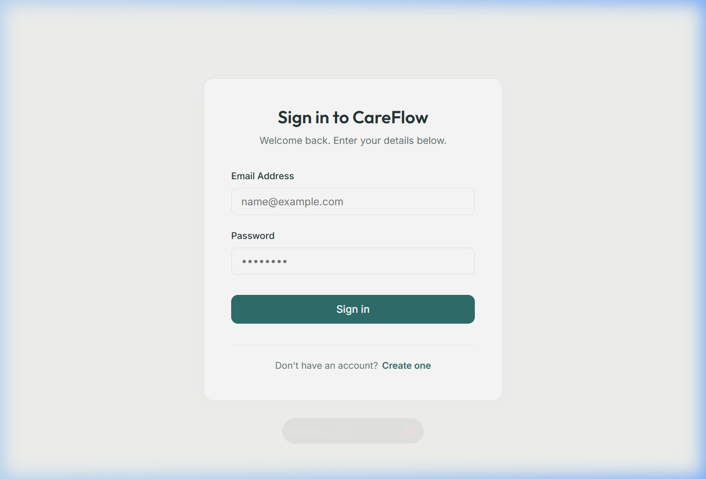
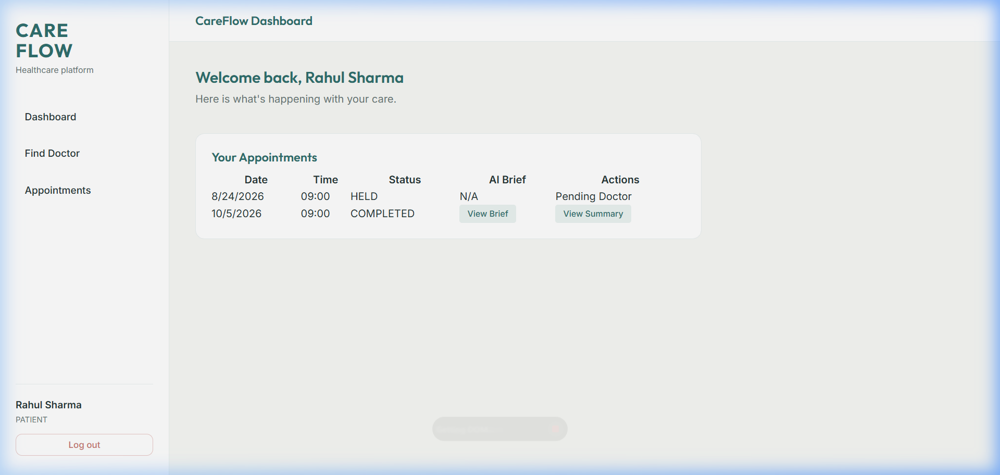
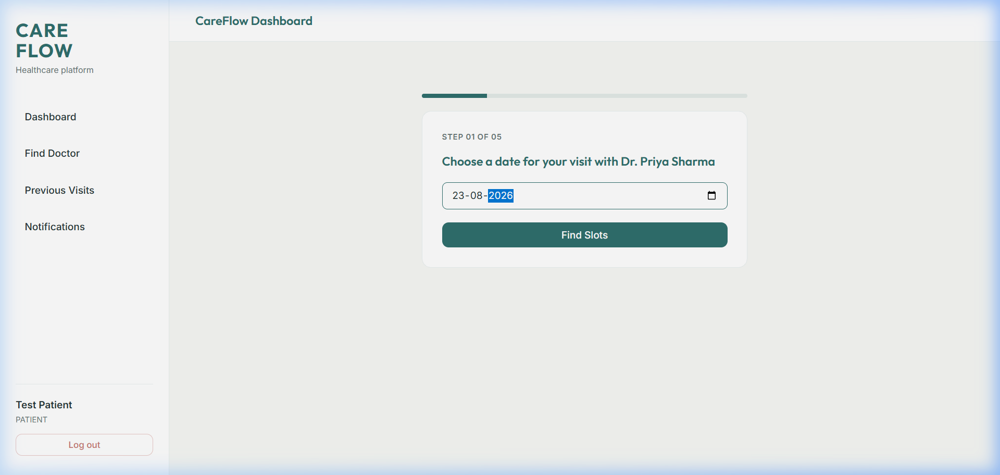
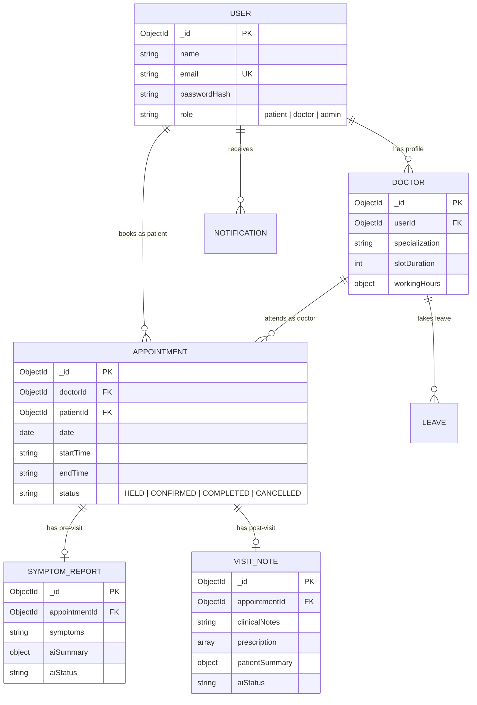

# 🏥 CareFlow — AI-Assisted Healthcare Appointment & Follow-up Platform

> **Healthcare, prepared before you arrive.**

[](https://www.mongodb.com/atlas)
[](https://nodejs.org)
[](https://react.dev)
[](https://ai.google.dev)
[](https://developers.google.com/calendar)

---

## 🌟 Overview & Key Highlights

CareFlow is a production-ready, full-stack healthcare appointment and clinical coordination platform designed to bridge the communication gap between patients, doctors, and administrators. 

### Core Capabilities
- **🧠 Pre-Visit AI Symptom Analysis**: Patient symptoms are analyzed by Google Gemini AI to generate structured pre-visit briefs for doctors, including urgency classification (`Low`, `Medium`, `High`), chief complaints, and suggested clinical questions.
- **💊 Post-Visit AI Summaries**: Clinical notes and prescriptions are automatically transformed into patient-friendly post-visit summaries with precaution checklists.
- **🔒 Race-Condition Safe Scheduling**: Atomic 5-minute slot hold locks and MongoDB partial unique indexes completely eliminate double-bookings even under concurrent user traffic.
- **🏖️ Doctor Leave Protection**: Applying doctor leave automatically cancels conflicting appointments, releases calendar slots, and dispatches instant notifications to affected patients.
- **📆 Persistent Google Calendar Sync**: OAuth 2.0 integration automatically creates, updates, and deletes calendar events for both patients and doctors upon booking or cancellation.
- **🔔 Resilient Notification Worker**: Database-backed notification queue with Nodemailer SMTP integration and exponential backoff retry worker.

---

## 📸 System Showcase & User Interface

| 🏠 Landing Page | 🔑 Authentication & Role Access |
|---|---|
|  |  |

| 📊 Patient Dashboard | ⏱ Time-Aware Booking & Slot Hold |
|---|---|
|  |  |

---

## 🚀 Local Setup & Installation Guide

### Prerequisites
- **Node.js**: `v18.x` or higher
- **npm**: `v9.x` or higher
- **MongoDB Atlas Connection URI** (or local MongoDB server)
- **Google Gemini API Key** (optional, mock fallback included)

---

### 1. Backend Setup

```bash
# Navigate to backend directory
cd Backend

# Install dependencies
npm install

# Create environment configuration file
cp .env.example .env
```

Edit `Backend/.env` with your environment credentials:
```env
PORT=5000
NODE_ENV=development
APP_TIMEZONE=Asia/Kolkata
MONGODB_URI=mongodb+srv://<username>:<password>@cluster0.mongodb.net/careflow?retryWrites=true&w=majority
JWT_SECRET=your_super_secret_jwt_key_here
GEMINI_API_KEY=your_gemini_api_key_here
EMAIL_SERVICE=gmail
EMAIL_USER=your_email@gmail.com
EMAIL_PASS=your_email_app_password
GOOGLE_CLIENT_ID=your_google_client_id
GOOGLE_CLIENT_SECRET=your_google_client_secret
GOOGLE_REDIRECT_URI=http://localhost:5000/api/auth/google/callback
FRONTEND_URL=http://localhost:5173
```

Start the backend development server:
```bash
npm run dev
```

---

### 2. Frontend Setup

```bash
# Navigate to frontend directory
cd Frontend

# Install dependencies
npm install

# Start Vite development server
npm run dev
```

Open your browser and visit: `http://localhost:5173/`

---

## 🔑 Test Credentials for Evaluation

The system comes pre-seeded with verification accounts across all three user roles:

| Role | Email | Password | Access Rights |
|---|---|---|---|
| 🧑‍🦱 **Patient** | `patient@careflow.com` | `password123` | Book slots, submit symptoms, view AI summaries |
| 👨‍⚕️ **Doctor** | `doctor@careflow.com` | `password123` | Manage schedule, view AI pre-visit briefs, submit notes & prescriptions |
| 🛡️ **Admin** | `admin@careflow.com` | `password123` | Create doctor profiles, manage leaves, view analytics dashboard |

---

## 📡 API Architecture & Documentation

### Authentication (`/api/auth`)
- `POST /api/auth/register` — Register a new patient account
- `POST /api/auth/login` — Authenticate and receive HTTP-only JWT token
- `POST /api/auth/logout` — Blacklist active JWT token (`jti`)
- `GET /api/auth/me` — Get current user profile details

### Doctor & Admin Management (`/api/admin`, `/api/doctors`)
- `GET /api/doctors` — Search doctors by specialization or name
- `GET /api/doctors/:id` — Fetch detailed doctor profile & working hours
- `POST /api/admin/doctors` — Create doctor user profile *(Admin only)*
- `PATCH /api/admin/doctors/:id` — Update doctor profile parameters *(Admin only)*
- `POST /api/admin/doctors/:doctorId/leave` — Mark doctor on leave & cancel conflicting slots *(Admin only)*

### Appointment Lifecycle (`/api/appointments`)
- `GET /api/appointments/doctors/:doctorId/availability?date=YYYY-MM-DD` — Time-aware slot availability
- `POST /api/appointments/hold` — Place 5-minute atomic reservation hold
- `POST /api/appointments/confirm` — Confirm booking, trigger calendar sync & email
- `GET /api/appointments` — List user's active/past appointments
- `PATCH /api/appointments/:id/cancel` — Cancel appointment & update calendar event

### AI Services (`/api/ai`)
- `POST /api/ai/pre-visit` — Submit patient symptoms to trigger Gemini pre-visit brief
- `POST /api/ai/post-visit` — Submit doctor notes & prescription for AI patient summary
- `PUT /api/ai/post-visit/:id` — Update consultation notes & re-run AI summary

---

## 🗄️ Database Schema Design



---

## 🤖 LLM Integration & Prompt Engineering

### 1. Pre-Visit Symptom Analysis
- **Model**: `gemini-3.6-flash` (with fallback to mock summary on quota limit)
- **Prompt**:
  > *"Analyze these patient symptoms and return a structured JSON response: urgency level (Low / Medium / High), chief complaint (brief summary), key symptoms (extracted list), and three suggested questions for the doctor. Do not diagnose the patient. Symptom Text: `<symptoms>`"*
- **Structured Schema**:
  ```json
  {
    "urgency": "Low | Medium | High",
    "chiefComplaint": "Concise clinical summary",
    "keySymptoms": ["Fever", "Headache"],
    "suggestedQuestions": ["Question 1", "Question 2", "Question 3"]
  }
  ```

### 2. Post-Visit Patient Summary
- **Model**: `gemini-3.6-flash`
- **Prompt**:
  > *"Convert these clinical notes into a patient-friendly summary with medication schedule and follow-up steps. Clinical Notes: `<notes>` Prescriptions: `<prescription_json>`. Do not invent any new medications."*
- **Failure Resilience**: If Gemini encounters rate limits (HTTP 429), the system saves symptoms/notes with `aiStatus = 'PENDING'`, schedules medication reminders, and informs the user gracefully without failing the request.

---

## 📅 Google Calendar OAuth 2.0 Integration Setup

1. Go to the [Google Cloud Console](https://console.cloud.google.com/).
2. Create a project and enable the **Google Calendar API**.
3. Configure the OAuth Consent Screen and add scope: `https://www.googleapis.com/auth/calendar.events`.
4. Create an **OAuth 2.0 Web Application Credential**.
5. Set Redirect URI to: `http://localhost:5000/api/auth/google/callback`.
6. Add `GOOGLE_CLIENT_ID` and `GOOGLE_CLIENT_SECRET` to `Backend/.env`.
7. When an appointment is confirmed, CareFlow invokes `googleCalendar.service.js` to create standard calendar events for both attendees.

---

## 📐 System Design Overview

*(For the complete 680-word system design analysis, see [SYSTEM_DESIGN.md](./SYSTEM_DESIGN.md))*

### Summary of Reliability Mechanisms
1. **Double-Booking Prevention**: Built using atomic `SlotHold` insertions and MongoDB partial unique indexes on `{ doctorId, date, startTime }` for active appointment states.
2. **Leave Conflict Handling**: Applying doctor leave atomically queries conflicting active appointments, updates them to `CANCELLED`, releases Google Calendar events, and dispatches automated notifications.
3. **Slot Holds & Time Awareness**: 300-second TTL holds prevent slot hoarding. Real-time time filtering in `Asia/Kolkata` disables past time slots.
4. **Notification Resilience**: Database-backed notification queue with background Nodemailer worker and exponential backoff retries.

---

## 🛠️ Verification & Test Suite

Run the included automated verification script to validate end-to-end appointment workflows:

```bash
cd Backend
node scratch/appointment_lifecycle_e2e.js
```

Expected output: `SUCCESS: All 20/20 lifecycle test steps passed!`

---

## 📄 License & Author

Created for CareFlow Healthcare Project. Built with React, Node.js, Express, MongoDB Atlas, and Google Gemini AI.
