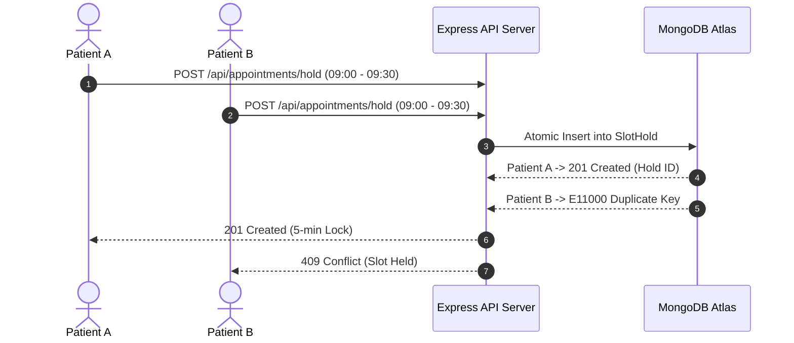
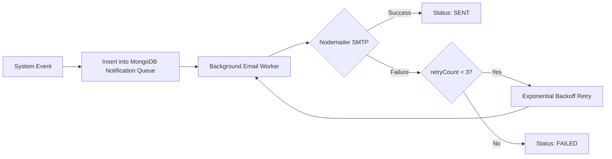

# CareFlow — System Design Architecture Document

## Executive Summary
CareFlow is an AI-assisted healthcare appointment coordination platform built for high concurrency, zero double-bookings, reliable notification delivery, and graceful third-party service degradation. This document outlines the key architectural patterns and failure recovery mechanisms powering the application.

---

## 1. Double-Booking Prevention & Concurrency Control



### Multi-Tiered Concurrency Strategy
1. **Atomic SlotHold Locks**: Before confirmation, slot hold requests perform an atomic insert into `SlotHold`, backed by a unique compound index on `{ doctorId, date, startTime }`. Simultaneous requests hit storage-engine level locking. The second request fails with `E11000`, returned as HTTP 409 Conflict.
2. **Partial Unique Index on Appointments**:
   Confirmed appointments enforce a partial unique index:
   ```javascript
   { doctorId: 1, date: 1, startTime: 1 },
   { partialFilterExpression: { status: { $in: ['PENDING', 'CONFIRMED', 'COMPLETED'] } } }
   ```
   If two confirmation requests race, MongoDB guarantees only one succeeds. When an appointment is `CANCELLED`, it exits the index filter, unlocking the slot instantly.

---

## 2. Doctor Leave Conflict Management

```mermaid
flowchart TD
    A[Admin Applies Leave] --> B[Insert Record with Unique Index {doctorId, date}]
    B --> C[Fetch Active Appointments on Date]
    C --> D{Conflicting Bookings?}
    D -- Yes --> E[Bulk Update Status to CANCELLED]
    E --> F[Delete/Update Google Calendar Events]
    E --> G[Enqueue DOCTOR_LEAVE_CONFLICT Notifications]
    G --> H[Dispatch Email & In-App Alerts]
```

- **Atomic Leave Registration**: Leaves use a unique index on `{ doctorId: 1, date: 1 }` to block duplicate leave entries.
- **Cascading Resolution**: Upon leave creation, a background handler finds all `PENDING` and `CONFIRMED` appointments on that date.
- **Auto-Cancellation & Alerts**: Conflicting bookings are updated to `CANCELLED` (`reason: "Doctor on leave"`), releasing calendar slots and triggering Nodemailer emails and system alerts for affected patients.

---

## 3. Slot Hold Reservation Mechanism & Time Awareness

### Slot Lifecycle State Machine
`AVAILABLE` ➔ `HELD (5 min)` ➔ `CONFIRMED` ➔ `COMPLETED`
*(Expired Holds: `HELD` ➔ `EXPIRED / AVAILABLE`)*

- **300-Second Hold Lock**: Slot holds automatically expire after 300 seconds (`expiresAt = now + 300s`).
- **Real-Time Timezone Filtering**: Available slots are computed relative to current local time in `Asia/Kolkata`. Slots in the past relative to the current timestamp are marked `PAST_DATE` / unbookable.
- **Hold Cleanup Janitor**: A background worker polls for expired holds (`expiresAt <= now`) and releases slots automatically.

---

## 4. Notification Pipeline & Failure Resilience



- **Persistence First**: All notifications are saved to MongoDB before network transmission.
- **Exponential Backoff**: Failed email dispatches increment `retryCount` and retry at `(2 ^ retryCount) × 30s` intervals.
- **Non-Blocking Execution**: Email dispatches run asynchronously, maintaining rapid API response times.
- **AI Graceful Degradation**: On Google Gemini rate limits (HTTP 429), symptoms remain safely persisted with `aiStatus = 'PENDING'`, displaying an informative status to the user without breaking booking flows.

---

## 5. Summary Database Schema

| Collection | Primary Key / Ref | Indexes & Constraints |
|---|---|---|
| **Users** | `_id` | `{ email: 1 }` (Unique) |
| **Doctors** | `userId` → User | `{ userId: 1 }` (Unique) |
| **Leaves** | `doctorId` → Doctor | `{ doctorId: 1, date: 1 }` (Unique) |
| **Appointments** | `doctorId`, `patientId` | Partial Unique `{ doctorId: 1, date: 1, startTime: 1 }` |
| **SymptomReports**| `appointmentId` → Appt | `{ appointmentId: 1 }` (Unique) |
| **VisitNotes** | `appointmentId` → Appt | `{ appointmentId: 1 }` (Unique) |
| **Notifications** | `recipientId` → User | `{ recipientId: 1, status: 1 }` |
